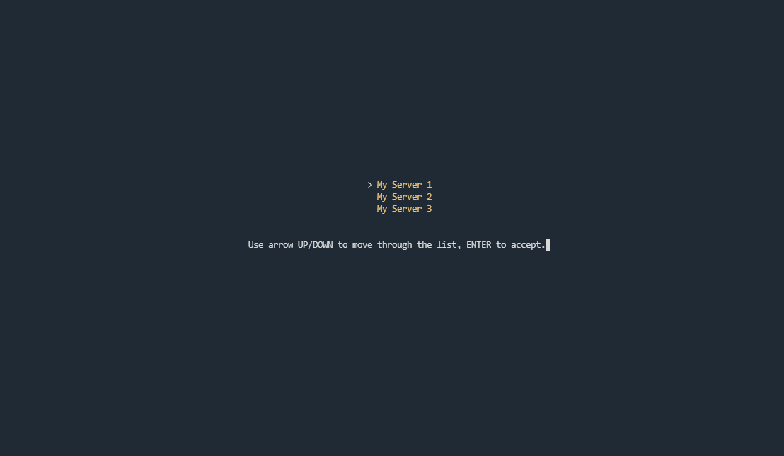
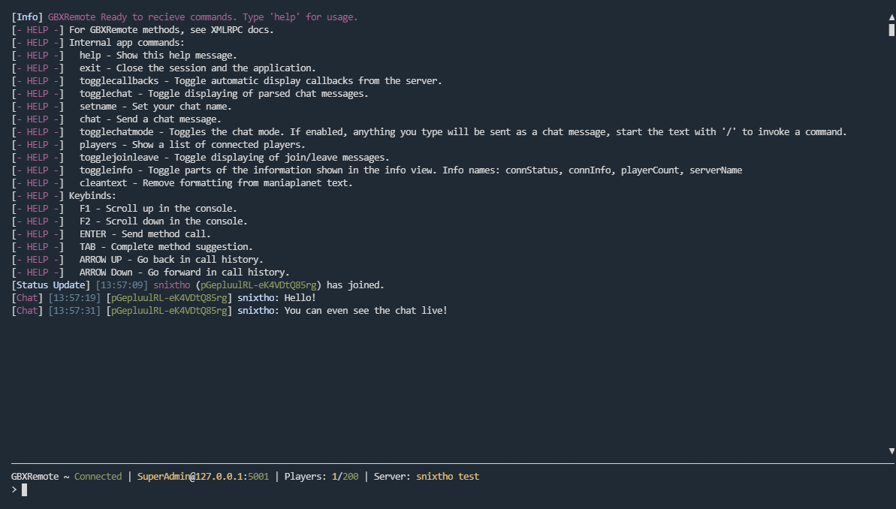

# Clifga
**Clifga** stands for **Command-Line Interface for GBXRemote Administration** and is a tool that can be used to connect to your Maniaplanet/Trackmania server to perform various administrational tasks through its XMLRPC protocol.

# Screenshots
## Server Selection

## Main View

# Features
- See and talk to the ingame chat.
- Set a custom admin chat name.
- Call any XMLRPC method.
- Show when a player joins or leaves.
- Show number of players in the server.
- Clean text formatting from the game.
- Can run out of the box on any machine with a default Python 3 installation.
- Send a XMLRPC call to multiple servers at once using the command-line.
- Use the command-line to check if a server is frozen. (Helpful for the TM2020 servers)

# Installation
1. Clone this repository `git clone https://github.com/snixtho/clifga.git`
2. Rename `config.example.json` to `config.json`
3. Edit `config.json` to your likings. You can add multiple servers if you wish.
4. Run it with python3. Example: `python3 clifga.py`

# Usage
By default anything you type will be directly sent to the XMLRPC server. You can call a XMLRPC method by first specifying the method name and then its arguments separated by spaces. 

For example: `SomeMethod arg1 "arg2" 123 ["arrays", "supported"] {"and": "structs as well"}`

To see internal commands and keybinds, type `help`.
To see command-line options use `-h` or `--help`.

# Config Explanation
- `chatMode`: Whether to enable "chat mode", which means anything you type will be sent to the chat.
- `callbacksDisplay`: Will show all callbacks from the XMLRPC server.
- `chatDisplay`: Enable/disable fetching of in-game chat.
- `showJoinAndLeave`: Enable/disable player join/leave messages.
- `infoView.connStatus`: Show connection status.
- `infoView.connInfo`: Show connection info.
- `infoView.playerCount`: Show player count.
- `infoView.serverName`: Show the name of the server.

## Server Config
The server config is an array of objects, each holds config for a server. The config for each server is:
- `name`: The name of a server, will be shown in the selection screen.
- `connection.host`: The host/IP address to the server.
- `connection.port`: The XMLRPC port of the server.
- `connection.username`: Super admin username.
- `connection.password`: Super admin password
